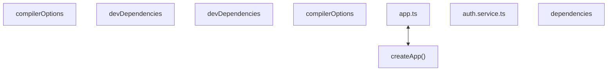

# Codebase Architectural Report

> **Auto-generated** by graphify knowledge graph analysis  
> **Purpose**: Dependency map, connection analysis, subsystem breakdown, and quality hotspots.

---

## 1. Executive Summary

- **Total Components**: `178`
- **Total Connections**: `202`
- **Subsystem Modules**: `1`
- **Dependency Types**: `10`

**Key Architectural Hubs:**

| # | Component | File | Type | Connections |
|---|-----------|------|------|-------------|
| 1 | `compilerOptions` | `frontend/tsconfig.json` | function | 15 |
| 2 | `devDependencies` | `backend/package.json` | function | 11 |
| 3 | `devDependencies` | `frontend/package.json` | function | 11 |
| 4 | `compilerOptions` | `backend/tsconfig.json` | function | 10 |
| 5 | `app.ts` | `backend/src/app.ts` | file | 8 |
| 6 | `auth.service.ts` | `backend/src/features/auth/auth.service.ts` | file | 8 |
| 7 | `dependencies` | `backend/package.json` | function | 7 |
| 8 | `createApp()` | `backend/src/app.ts` | method | 7 |

---

## 2. Dependency & Connection Analysis

### Relationship Types

| Relationship | Count | Share |
|-------------|-------|-------|
| `contains` | 107 | 53% |
| `imports` | 48 | 24% |
| `imports_from` | 15 | 7% |
| `calls` | 10 | 5% |
| `extends` | 10 | 5% |
| `method` | 5 | 2% |
| `references` | 3 | 1% |
| `indirect_call` | 2 | 1% |
| `inherits` | 1 | 0% |
| `rationale_for` | 1 | 0% |

### Hub Dependency Diagram

### Most Connected Pairs

| Component A | Component B | Shared Connections |
|-------------|-------------|-------------------|
| `build` | `scripts` | 2 |
| `dev` | `scripts` | 2 |
| `scripts` | `start` | 2 |
| `scripts` | `test` | 2 |
| `@types/node` | `devDependencies` | 2 |
| `devDependencies` | `typescript` | 2 |
| `devDependencies` | `vitest` | 2 |
| `@types/node` | `@types/node` | 2 |
| `typescript` | `typescript` | 2 |
| `vitest` | `vitest` | 2 |

---

## 3. Subsystem & Module Breakdown

### 3.1 package.json
**Nodes**: `178`  
**Files**: `.engine/memory/progress_summary.md`, `.engine/workers/a6ed9cd73c40/scratch/findings.md`, `backend/package.json`, `backend/src/app.ts`, `backend/src/config.ts`, `backend/src/db/database.ts` +22 more

| Component | Type | File | Connections |
|-----------|------|------|-------------|
| `compilerOptions` | function | `frontend/tsconfig.json` | 15 |
| `devDependencies` | function | `backend/package.json` | 11 |
| `devDependencies` | function | `frontend/package.json` | 11 |
| `compilerOptions` | function | `backend/tsconfig.json` | 10 |
| `app.ts` | file | `backend/src/app.ts` | 8 |
| `auth.service.ts` | file | `backend/src/features/auth/auth.service.ts` | 8 |
| `dependencies` | function | `backend/package.json` | 7 |
| `createApp()` | method | `backend/src/app.ts` | 7 |
| `index.ts` | file | `backend/src/index.ts` | 7 |
| `LoginForm.tsx` | class | `frontend/components/auth/LoginForm.tsx` | 7 |

**External dependencies:** `NOTE: This file should not be edited` (1)

---

## 4. API Reference

Public classes and functions by subsystem.

### package.json

| Name | Type | File | Connections |
|------|------|------|-------------|
| `compilerOptions` | function | `frontend/tsconfig.json` | 15 |
| `devDependencies` | function | `backend/package.json` | 11 |
| `devDependencies` | function | `frontend/package.json` | 11 |
| `compilerOptions` | function | `backend/tsconfig.json` | 10 |
| `dependencies` | function | `backend/package.json` | 7 |
| `LoginForm.tsx` | class | `frontend/components/auth/LoginForm.tsx` | 7 |
| `backend/package.json` | function | `backend/package.json` | 6 |
| `AuthService` | class | `backend/src/features/auth/auth.service.ts` | 6 |

---

## 5. Code Quality & Architectural Risk Hotspots

### Component Type Distribution

| Type | Count | Share |
|------|-------|-------|
| function | 129 | 72% |
| file | 18 | 10% |
| method | 17 | 10% |
| class | 14 | 8% |

### Dependency Cycles

**37** circular dependency loop(s) detected:

| # | Cycle Path |
|---|-----------|
| 1 | `frontend_package_devdependencies_types_node → backend_package_json_types_node → backend_package_devdependencies_types_node → backend_package_devdependencies → backend_package_devdependencies_typescript → backend_package_json_typescript → frontend_package_devdependencies_typescript → frontend_package_devdependencies` |
| 2 | `frontend_lib_api_client → frontend_lib_api_client_requestotp → frontend_lib_api_client_post` |
| 3 | `frontend_components_auth_loginform → frontend_components_auth_loginform_loginform → frontend_lib_api_client_requestotp` |
| 4 | `frontend_components_auth_loginform → frontend_tests_loginform_test → frontend_components_auth_loginform_loginform` |
| 5 | `frontend_components_auth_loginform → frontend_lib_api_client_verifyotp → frontend_components_auth_loginform_loginform` |
| 6 | `frontend_lib_api_client → frontend_lib_api_client_verifyotp → frontend_components_auth_loginform_loginform → frontend_lib_api_client_requestotp` |
| 7 | `frontend_components_auth_loginform → frontend_app_login_page → frontend_components_auth_loginform_loginform` |
| 8 | `frontend_lib_api_client → frontend_components_auth_loginform → frontend_lib_api_client_requestotp` |
| 9 | `frontend_lib_api_client → frontend_lib_api_client_apierror → frontend_components_auth_loginform` |
| 10 | `backend_src_db_database → backend_src_db_database_createdatabase → backend_tests_auth_api_test` |

### Orphaned Components

**4** isolated node(s) with no connections:

| Component | File |
|-----------|------|
| `auth.spec.ts` | `frontend/e2e/auth.spec.ts` |
| `vitest.config.ts` | `frontend/vitest.config.ts` |
| `vitest.setup.ts` | `frontend/vitest.setup.ts` |
| `better-sqlite3 Native Build Limitation` | `.engine/workers/a6ed9cd73c40/scratch/findings.md` |

---

## 6. How to Navigate

1. **Interactive D3 Map** — open `graph.html` to explore node connections visually.
2. **Knowledge Graph Queries** — use MCP tools (`graph_query`, `graph_explain_node`, `graph_impact_radius`).
